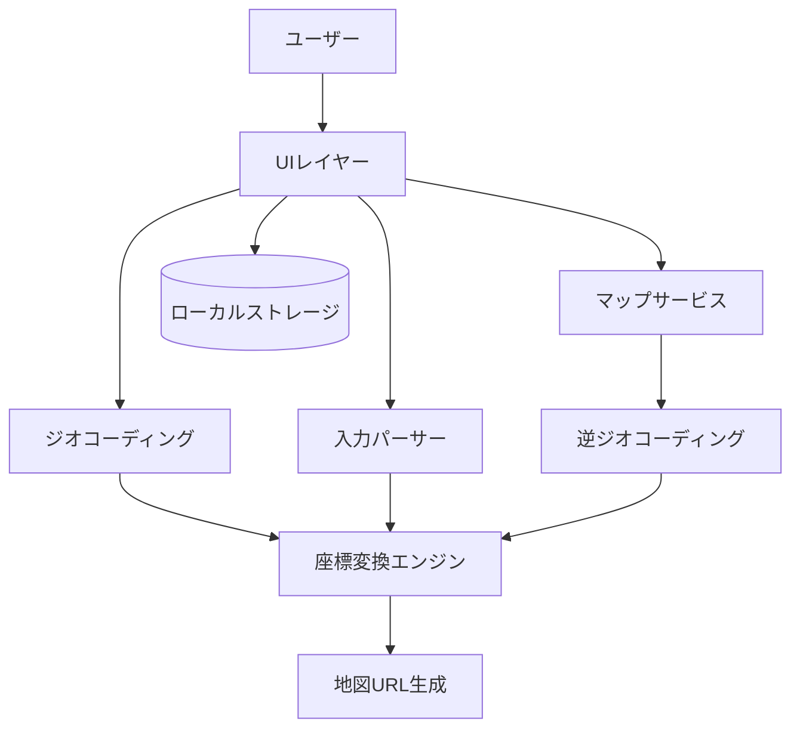
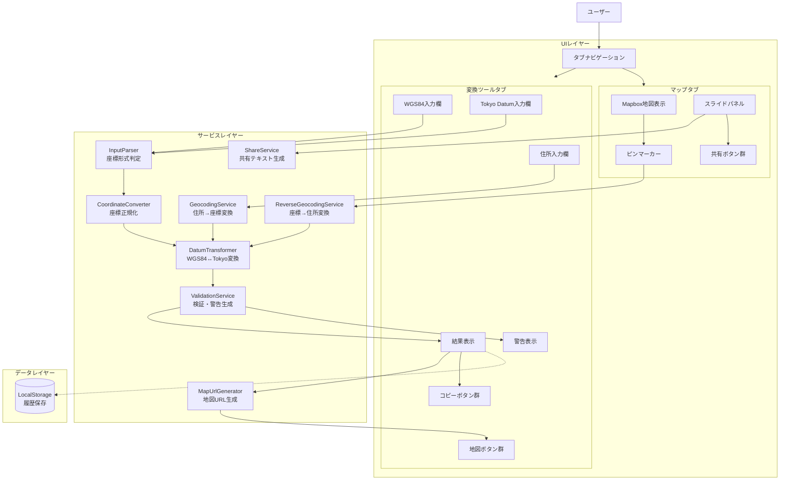
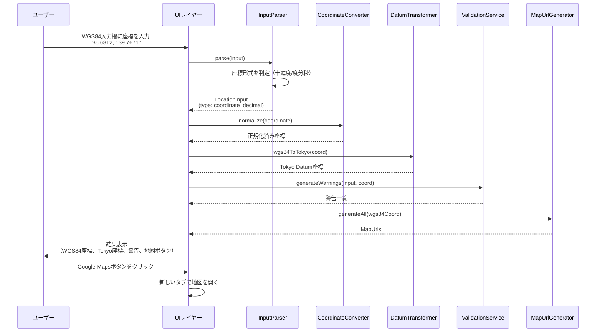
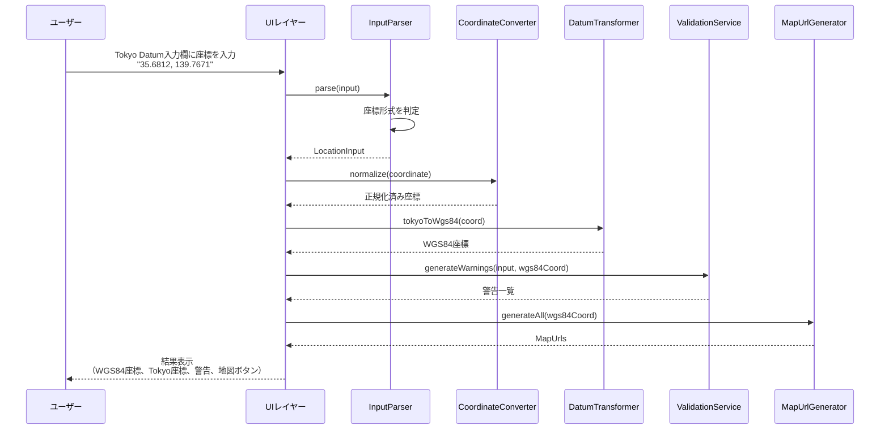
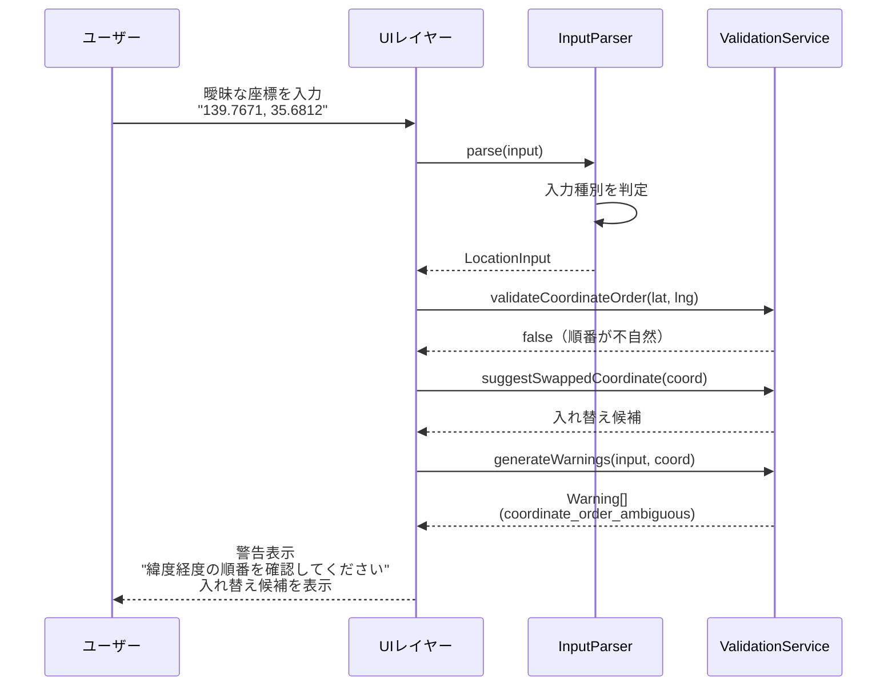
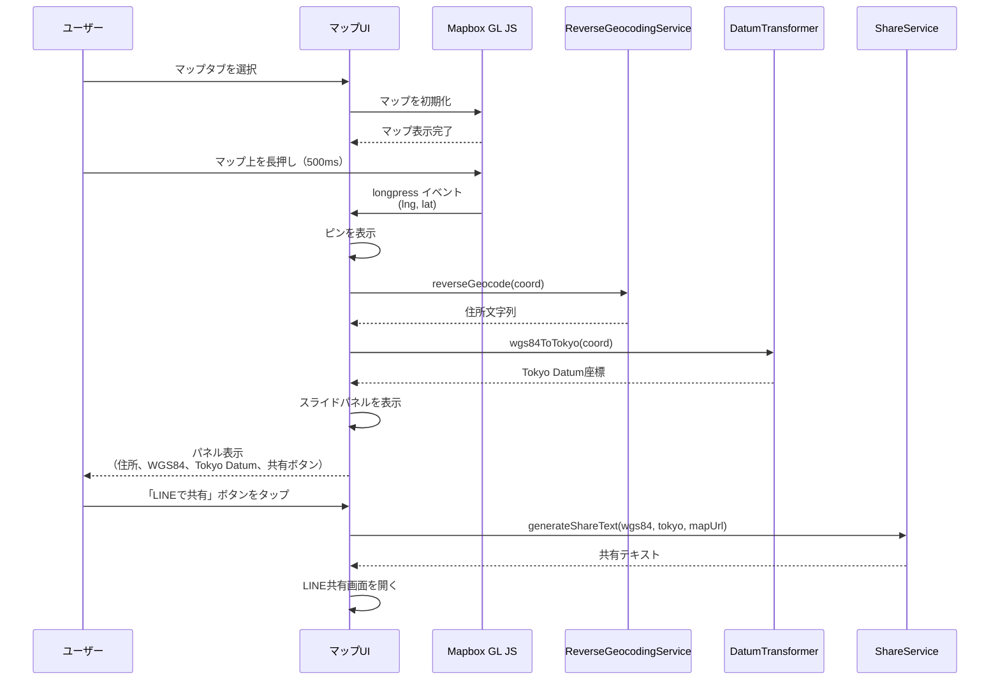
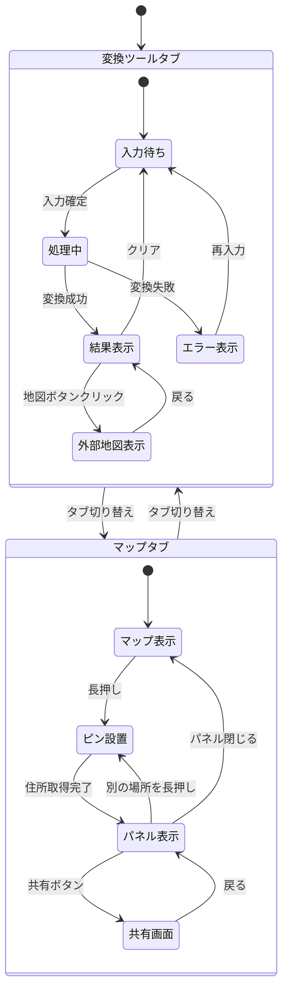

# 機能設計書 (Functional Design Document)

## システム構成図



### 詳細構成図



## 技術スタック

| 分類           | 技術                         | 選定理由                                           |
| -------------- | ---------------------------- | -------------------------------------------------- |
| 言語           | TypeScript 5.x               | 型安全性、開発効率、Node.js環境との親和性          |
| フレームワーク | Next.js 15 (React 19)        | Vercelとの親和性、App Router、将来のAPI Routes対応 |
| スタイリング   | Tailwind CSS                 | ユーティリティファースト、レスポンシブ対応         |
| 座標変換       | proj4js                      | 測地系変換のデファクトスタンダード                 |
| テスト         | Jest + React Testing Library | Next.js公式サポート、広いエコシステム              |
| デプロイ       | Vercel                       | Next.js開発元、自動デプロイ、無料枠あり            |

## データモデル定義

### エンティティ: LocationInput（入力データ）

```typescript
interface LocationInput {
  rawInput: string; // 生の入力文字列
  inputType: InputType; // 判定された入力種別
  confidence: number; // 判定の確信度 (0-1)
  parsedData: ParsedCoordinate | ParsedAddress | null; // パース結果
}

type InputType =
  | "coordinate_decimal" // 十進度形式の座標
  | "coordinate_dms" // 度分秒形式の座標
  | "address" // 住所
  | "unknown"; // 判定不能
```

### エンティティ: ParsedCoordinate（パース済み座標）

```typescript
interface ParsedCoordinate {
  latitude: number; // 緯度（十進度）
  longitude: number; // 経度（十進度）
  originalFormat: CoordinateFormat; // 元の形式
}

type CoordinateFormat =
  | "decimal" // 十進度 (35.6812)
  | "dms" // 度分秒 (35°40'52")
  | "dmm"; // 度分 (35°40.867')

type Datum =
  | "WGS84" // 世界測地系
  | "TOKYO"; // 旧日本測地系

// 入力ソース（どの入力欄から入力されたか）
type InputSource =
  | "address" // 住所入力欄
  | "wgs84" // WGS84座標入力欄
  | "tokyo"; // Tokyo Datum座標入力欄
```

### エンティティ: ParsedAddress（パース済み住所）

```typescript
interface ParsedAddress {
  fullAddress: string; // 正規化された住所
  prefecture?: string; // 都道府県
  city?: string; // 市区町村
  town?: string; // 町名
  block?: string; // 番地
}
```

### エンティティ: ConversionResult（変換結果）

```typescript
interface ConversionResult {
  input: LocationInput; // 入力データ
  inputSource: InputSource; // 入力元（どの入力欄から）
  coordinates: {
    wgs84: Coordinate; // WGS84座標
    tokyo: Coordinate; // 旧日本測地系（Tokyo Datum）座標
  };
  address?: string; // 逆ジオコーディング結果（将来）
  mapUrls: MapUrls; // 各地図サービスのURL
  warnings: Warning[]; // 警告一覧
  timestamp: Date; // 変換日時
}

interface Coordinate {
  latitude: number; // 緯度（小数点以下6桁）
  longitude: number; // 経度（小数点以下6桁）
}

interface MapUrls {
  googleMaps: string;
  yahooMap: string;
  appleMaps: string;
  gsiMap: string;
}
```

### エンティティ: Warning（警告）

```typescript
interface Warning {
  type: WarningType;
  message: string;
  severity: "info" | "warning" | "error";
}

type WarningType =
  | "coordinate_order_ambiguous" // 緯度経度の順番が曖昧
  | "outside_japan" // 日本国外の座標
  | "low_confidence" // 判定の確信度が低い
  | "coordinate_swap_suggested" // 緯度経度入れ替えの提案
  | "address_partial_match"; // 住所が部分的にマッチ（入力より短い住所でマッチ）
```

### エンティティ: ConversionHistory（変換履歴）

```typescript
interface ConversionHistory {
  id: string; // UUID
  input: string; // 入力文字列
  result: ConversionResult; // 変換結果
  createdAt: Date; // 作成日時
}
```

### エンティティ: PinLocation（ピン位置情報）

```typescript
interface PinLocation {
  coordinate: Coordinate;        // WGS84座標（ピン位置）
  tokyoCoordinate: Coordinate;   // Tokyo Datum座標
  address?: string;              // 逆ジオコーディングで取得した住所
  timestamp: Date;               // ピン設置日時
}
```

### エンティティ: MapState（マップ状態）

```typescript
interface MapState {
  center: Coordinate;    // マップ中心座標
  zoom: number;          // ズームレベル（1-22）
  pin: PinLocation | null;  // 現在のピン位置
}

// 初期値
const DEFAULT_MAP_STATE: MapState = {
  center: { latitude: 35.6812, longitude: 139.7671 }, // 東京駅
  zoom: 5, // 日本全体が見える程度
  pin: null,
};
```

## コンポーネント設計

### InputParser（入力パーサー）

**責務**:

- 座標形式（十進度/度分秒）を識別する
- 座標文字列をパースして緯度・経度を抽出する

**インターフェース**:

```typescript
class InputParser {
  // 入力を解析して座標形式を判定
  parse(input: string): LocationInput;

  // 十進度形式かどうかを判定
  private isDecimalCoordinate(input: string): boolean;

  // 度分秒形式かどうかを判定
  private isDmsCoordinate(input: string): boolean;

  // 十進度座標をパース
  private parseDecimalCoordinate(input: string): ParsedCoordinate | null;

  // 度分秒座標をパース
  private parseDmsCoordinate(input: string): ParsedCoordinate | null;
}
```

**依存関係**:

- なし（純粋な文字列処理）

### CoordinateConverter（座標変換エンジン）

**責務**:

- 度分秒から十進度への変換
- 十進度から度分秒への変換
- 座標のフォーマット統一

**インターフェース**:

```typescript
class CoordinateConverter {
  // 度分秒を十進度に変換
  dmsToDecimal(degrees: number, minutes: number, seconds: number): number;

  // 十進度を度分秒に変換
  decimalToDms(decimal: number): {
    degrees: number;
    minutes: number;
    seconds: number;
  };

  // 座標を正規化（小数点以下6桁）
  normalize(coordinate: Coordinate): Coordinate;
}
```

**依存関係**:

- なし（純粋な計算処理）

### DatumTransformer（測地系変換）

**責務**:

- WGS84 ↔ 旧日本測地系(Tokyo Datum) の相互変換

**インターフェース**:

```typescript
class DatumTransformer {
  // WGS84から旧日本測地系への変換
  wgs84ToTokyo(coord: Coordinate): Coordinate;

  // 旧日本測地系からWGS84への変換
  tokyoToWgs84(coord: Coordinate): Coordinate;
}
```

**変換精度**:

- WGS84 ↔ Tokyo Datum の差: 約400-500m
- proj4jsの変換パラメータ: `+towgs84=-146.414,507.337,680.507,0,0,0,0`

**依存関係**:

- proj4js（測地系変換ライブラリ）

### ValidationService（検証・警告生成）

**責務**:

- 入力値の妥当性検証
- 警告の生成
- 曖昧性の検出

**インターフェース**:

```typescript
class ValidationService {
  // 座標が日本国内かどうかを検証
  isWithinJapan(coord: Coordinate): boolean;

  // 緯度経度の順番が妥当かを検証
  validateCoordinateOrder(lat: number, lng: number): boolean;

  // 警告を生成
  generateWarnings(input: LocationInput, coord: Coordinate): Warning[];

  // 緯度経度入れ替え候補を生成
  suggestSwappedCoordinate(coord: Coordinate): Coordinate | null;
}
```

**依存関係**:

- なし

### GeocodingService（ジオコーディング）

**責務**:

- 住所から座標への変換（ジオコーディング）
- Yahoo!ジオコーダAPIとの通信（API Route経由）
- 住所文字列の正規化
- 入力住所とマッチ住所の比較による警告生成

**インターフェース**:

```typescript
interface GeocodingResult {
  coordinate: Coordinate; // WGS84座標
  matchedAddress: string; // マッチした住所文字列
}

type GeocodingErrorCode = "NOT_FOUND" | "NETWORK_ERROR" | "API_ERROR";

class GeocodingError extends Error {
  readonly code: GeocodingErrorCode;
}

class GeocodingService {
  // 住所を座標に変換
  async geocode(address: string): Promise<GeocodingResult>;
}
```

**使用API**:

- Yahoo!ジオコーダAPI（API Route `/api/geocode` 経由）
- エンドポイント: `https://map.yahooapis.jp/geocode/V1/geoCoder`
- 無料枠: 1日5万リクエスト
- 要件: Yahoo! Client ID（環境変数 `YAHOO_CLIENT_ID`）
- 精度: 番地レベル

**エラーハンドリング**:
| エラー種別 | エラーコード | ユーザーへの表示 |
|-----------|-------------|-----------------|
| 空入力 | NOT_FOUND | 「住所を入力してください」 |
| 住所未発見 | NOT_FOUND | 「指定された住所が見つかりませんでした」 |
| ネットワークエラー | NETWORK_ERROR | 「ネットワークエラーが発生しました」 |
| タイムアウト | NETWORK_ERROR | 「接続がタイムアウトしました」 |
| APIエラー | API_ERROR | 「APIエラーが発生しました」 |

**警告（正常処理時）**:
| 状況 | 警告種別 | 表示内容 |
|------|----------|---------|
| 入力住所とマッチ住所が異なる | address_partial_match | 「〇〇」までの情報で位置を特定しました |

**依存関係**:

- なし（ブラウザ標準のfetch APIを使用）

### MapUrlGenerator（地図URL生成）

**責務**:

- 各地図サービスのURL生成
- URLパラメータの適切なエンコード

**インターフェース**:

```typescript
class MapUrlGenerator {
  // 全地図サービスのURLを生成
  generateAll(coord: Coordinate): MapUrls;

  // Google Maps URL生成
  generateGoogleMaps(coord: Coordinate): string;

  // Yahoo!地図 URL生成
  generateYahooMap(coord: Coordinate): string;

  // Apple Maps URL生成
  generateAppleMaps(coord: Coordinate): string;

  // 地理院地図 URL生成
  generateGsiMap(coord: Coordinate): string;
}
```

**依存関係**:

- なし

### ReverseGeocodingService（逆ジオコーディング）

**責務**:

- 座標から住所への変換（逆ジオコーディング）
- Mapbox Geocoding APIまたはYahoo!逆ジオコーダAPIとの通信

**インターフェース**:

```typescript
interface ReverseGeocodingResult {
  address: string;           // 住所文字列
  prefecture?: string;       // 都道府県
  city?: string;             // 市区町村
}

class ReverseGeocodingService {
  // 座標を住所に変換
  async reverseGeocode(coord: Coordinate): Promise<ReverseGeocodingResult>;
}
```

**使用API**:

- Mapbox Geocoding API（推奨）
- エンドポイント: `https://api.mapbox.com/geocoding/v5/mapbox.places/{lng},{lat}.json`
- 認証: `access_token`パラメータ
- 無料枠: 100,000件/月

**依存関係**:

- なし（fetch APIを使用）

### MapInteractionService（マップインタラクション）

**責務**:

- マップの長押し検出
- ピン位置の管理
- スライドパネルの表示状態管理

**インターフェース**:

```typescript
interface PinLocation {
  coordinate: Coordinate;    // WGS84座標
  address?: string;          // 逆ジオコーディング結果
  tokyoCoordinate?: Coordinate;  // Tokyo Datum座標
}

interface MapInteractionState {
  pin: PinLocation | null;
  isPanelOpen: boolean;
  isLoadingAddress: boolean;
}

// カスタムフック
function useMapInteraction(): {
  state: MapInteractionState;
  handleLongPress: (lngLat: { lng: number; lat: number }) => void;
  closePanel: () => void;
};
```

**依存関係**:

- ReverseGeocodingService
- DatumTransformer

## ユースケース図

### ユースケース1: WGS84座標入力→地図起動



**フロー説明**:

1. ユーザーがWGS84入力欄に座標を貼り付け
2. InputParserが座標形式を判定（十進度/度分秒）
3. CoordinateConverterが座標を正規化
4. DatumTransformerがTokyo Datumに変換
5. ValidationServiceが警告を生成
6. MapUrlGeneratorが各地図サービスのURLを生成（WGS84座標を使用）
7. UIに結果を表示
8. ユーザーが地図ボタンをクリックして地図を開く

### ユースケース1b: Tokyo Datum座標入力→地図起動



**フロー説明**:

1. ユーザーがTokyo Datum入力欄に座標を貼り付け
2. InputParserが座標形式を判定
3. CoordinateConverterが座標を正規化
4. DatumTransformerがWGS84に変換（約400-500m移動）
5. ValidationServiceが警告を生成
6. MapUrlGeneratorが各地図サービスのURLを生成（WGS84座標を使用）
7. UIに結果を表示

### ユースケース2: 曖昧な入力→警告表示



### ユースケース3: マップ長押し→座標取得→共有



**フロー説明**:

1. ユーザーがマップタブを選択
2. Mapbox GL JSでマップを表示
3. ユーザーがマップ上を長押し（約500ms）
4. 長押し位置にピンを表示
5. 逆ジオコーディングで住所を取得
6. 座標をTokyo Datumに変換
7. スライドパネルに情報を表示
8. 共有ボタンで位置情報を共有

## 画面遷移図



## アルゴリズム設計

### 座標形式判定アルゴリズム

**目的**: 座標入力欄に入力された文字列が十進度か度分秒かを判定する

**計算ロジック**:

#### ステップ1: 前処理

- 全角数字を半角に変換
- 前後の空白を除去
- 複数の空白を単一に正規化

#### ステップ2: 十進度座標パターンマッチ

```typescript
// 十進度形式のパターン
const DECIMAL_PATTERNS = [
  // カンマ区切り: 35.6812, 139.7671
  /^(-?\d+\.?\d*)\s*,\s*(-?\d+\.?\d*)$/,
  // 空白区切り: 35.6812 139.7671
  /^(-?\d+\.?\d*)\s+(-?\d+\.?\d*)$/,
  // N/E表記: N35.6812 E139.7671
  /^[NS]?\s*(-?\d+\.?\d*)\s*[,\s]\s*[EW]?\s*(-?\d+\.?\d*)$/i,
];
```

#### ステップ3: 度分秒座標パターンマッチ

```typescript
// 度分秒形式のパターン
const DMS_PATTERNS = [
  // 記号付き: 35°40'52"N 139°46'2"E
  /(\d+)°(\d+)'([\d.]+)"?\s*([NS])?\s*[,\s]\s*(\d+)°(\d+)'([\d.]+)"?\s*([EW])?/i,
  // 数字のみ: 354052 1394602
  /^(\d{2})(\d{2})(\d{2})\s+(\d{3})(\d{2})(\d{2})$/,
];
```

#### ステップ4: 確信度計算

```typescript
function calculateConfidence(input: string, type: InputType): number {
  // 明確なパターンマッチ: 0.9-1.0
  // 部分的なマッチ: 0.6-0.8
  // 推測による判定: 0.3-0.5
  // 判定不能: 0.0
}
```

**実装例**:

```typescript
class InputParser {
  parse(input: string): LocationInput {
    const normalized = this.normalize(input);

    // 十進度座標を試行
    const decimalResult = this.parseDecimalCoordinate(normalized);
    if (decimalResult) {
      return {
        rawInput: input,
        inputType: "coordinate_decimal",
        confidence: decimalResult.confidence,
        parsedData: decimalResult.coordinate,
      };
    }

    // 度分秒座標を試行
    const dmsResult = this.parseDmsCoordinate(normalized);
    if (dmsResult) {
      return {
        rawInput: input,
        inputType: "coordinate_dms",
        confidence: dmsResult.confidence,
        parsedData: dmsResult.coordinate,
      };
    }

    return {
      rawInput: input,
      inputType: "unknown",
      confidence: 0,
      parsedData: null,
    };
  }

  private normalize(input: string): string {
    return input
      .replace(/[０-９]/g, (s) => String.fromCharCode(s.charCodeAt(0) - 0xfee0))
      .replace(/[．]/g, ".")
      .replace(/[，]/g, ",")
      .trim()
      .replace(/\s+/g, " ");
  }
}
```

### 座標順序検証アルゴリズム

**目的**: 緯度と経度が入れ替わっている可能性を検出する

**計算ロジック**:

```typescript
class ValidationService {
  // 日本の緯度範囲: 約20°〜46°
  // 日本の経度範囲: 約122°〜154°

  validateCoordinateOrder(lat: number, lng: number): boolean {
    const isLatInRange = lat >= 20 && lat <= 46;
    const isLngInRange = lng >= 122 && lng <= 154;

    // 両方が範囲内なら正しい順序
    if (isLatInRange && isLngInRange) {
      return true;
    }

    // 入れ替えた方が範囲内に収まるか確認
    const swappedLatInRange = lng >= 20 && lng <= 46;
    const swappedLngInRange = lat >= 122 && lat <= 154;

    if (swappedLatInRange && swappedLngInRange) {
      // 入れ替えた方が正しい可能性が高い
      return false;
    }

    // どちらも判定できない
    return true;
  }

  suggestSwappedCoordinate(coord: Coordinate): Coordinate | null {
    if (!this.validateCoordinateOrder(coord.latitude, coord.longitude)) {
      return {
        latitude: coord.longitude,
        longitude: coord.latitude,
      };
    }
    return null;
  }
}
```

### 測地系変換アルゴリズム

**目的**: WGS84とTokyo Datum間の座標変換

**計算ロジック**:

```typescript
class DatumTransformer {
  // proj4の定義
  // WGS84: EPSG:4326 (デフォルト)
  // Tokyo Datum: EPSG:4301

  private static readonly TOKYO_PROJ =
    "+proj=longlat +ellps=bessel +towgs84=-146.414,507.337,680.507,0,0,0,0 +no_defs";

  wgs84ToTokyo(coord: Coordinate): Coordinate {
    // WGS84 → Tokyo Datum
    // 結果は約400-500m南西にシフト
    const result = proj4("EPSG:4326", this.TOKYO_PROJ, [
      coord.longitude,
      coord.latitude,
    ]);
    return this.normalize({ latitude: result[1], longitude: result[0] });
  }

  tokyoToWgs84(coord: Coordinate): Coordinate {
    // Tokyo Datum → WGS84
    // 結果は約400-500m北東にシフト
    const result = proj4(this.TOKYO_PROJ, "EPSG:4326", [
      coord.longitude,
      coord.latitude,
    ]);
    return this.normalize({ latitude: result[1], longitude: result[0] });
  }
}
```

**変換の特徴**:

- Tokyo Datum → WGS84: 座標は北東方向に約400-500m移動
- WGS84 → Tokyo Datum: 座標は南西方向に約400-500m移動
- 入力欄ごとに測地系が確定しているため、推定処理は不要

## UI設計

### メイン画面レイアウト

```
┌─────────────────────────────────────────────────────────────────┐
│  🗺️ ichi-link - 位置情報変換ツール                              │
├─────────────────────────────────────────────────────────────────┤
│                                                                 │
│  位置情報を入力                                                  │
│                                                                 │
│  住所                                                           │
│  ┌─────────────────────────────────────────────────┐ [変換]   │
│  │ 例: 東京都千代田区丸の内1-1-1                    │          │
│  └─────────────────────────────────────────────────┘          │
│                                                                 │
│  世界測地系（WGS84）                                            │
│  ┌─────────────────────────────────────────────────┐ [変換]   │
│  │ 例: 35.6812, 139.7671                           │          │
│  └─────────────────────────────────────────────────┘          │
│                                                                 │
│  旧日本測地系（Tokyo Datum）                                    │
│  ┌─────────────────────────────────────────────────┐ [変換]   │
│  │ 例: 35.6812, 139.7671                           │          │
│  └─────────────────────────────────────────────────┘          │
│                                                                 │
├─────────────────────────────────────────────────────────────────┤
│  📋 判定結果                                                    │
│  └─ 入力種別: 十進度の緯度経度                                   │
│                                                                 │
│  ⚠️ 警告（ある場合のみ表示）                                     │
│  └─ 緯度経度の順番を確認してください                              │
│     → 入れ替え候補: 139.7671, 35.6812                           │
│                                                                 │
├─────────────────────────────────────────────────────────────────┤
│  📍 変換結果                                                    │
│  ┌─────────────────────────────────────────────────────────┐   │
│  │ WGS84        35.681200, 139.767100          [コピー]    │   │
│  │ Tokyo Datum  35.677xxx, 139.763xxx          [コピー]    │   │
│  └─────────────────────────────────────────────────────────┘   │
│                                            [全部コピー] ボタン   │
│                                                                 │
├─────────────────────────────────────────────────────────────────┤
│  🗺️ 地図で開く                                                  │
│  ┌───────────┐ ┌───────────┐ ┌───────────┐ ┌───────────┐      │
│  │ Google    │ │ Yahoo!    │ │ Apple     │ │ 地理院    │      │
│  │ Maps      │ │ 地図      │ │ Maps      │ │ 地図      │      │
│  └───────────┘ └───────────┘ └───────────┘ └───────────┘      │
│                                                                 │
└─────────────────────────────────────────────────────────────────┘
```

### 入力欄の動作

| 入力欄      | 測地系 | 変換処理                     | 状態                            |
| ----------- | ------ | ---------------------------- | ------------------------------- |
| 住所        | -      | ジオコーディング→WGS84→Tokyo | 有効（Yahoo!ジオコーダAPI使用） |
| WGS84       | WGS84  | WGS84→Tokyo変換              | 有効                            |
| Tokyo Datum | Tokyo  | Tokyo→WGS84変換              | 有効                            |

### タブナビゲーションレイアウト

```
┌─────────────────────────────────────────────────────────────────┐
│  [ 変換ツール ]  [ マップ ]                                      │
│  ─────────────                                                   │
│  ↑ 選択中タブにアンダーライン（青色）                            │
├─────────────────────────────────────────────────────────────────┤
│                                                                 │
│           タブに応じたコンテンツを表示                            │
│                                                                 │
└─────────────────────────────────────────────────────────────────┘
```

### マップタブレイアウト

```
┌─────────────────────────────────────────────────────────────────┐
│  [ 変換ツール ]  [ マップ ]                                      │
├─────────────────────────────────────────────────────────────────┤
│                                                                 │
│                                                                 │
│                     Mapbox 地図表示                              │
│                    （フルスクリーン）                            │
│                                                                 │
│                         📍                                      │
│                       (ピン)                                    │
│                                                                 │
│                                                                 │
├─────────────────────────────────────────────────────────────────┤
│  ↑ スライドパネル（長押し後にボトムシートとして表示）            │
│  ┌─────────────────────────────────────────────────────────┐   │
│  │ ━━━━━ (ドラッグハンドル)                                │   │
│  │                                                          │   │
│  │ [LINEで共有] [共有]                   ← 共有ボタン群     │   │
│  │                                                          │   │
│  │ ─────────────────────────────────────────────────────── │   │
│  │                                                          │   │
│  │ 住所                                                     │   │
│  │ 東京都千代田区丸の内1-1-1                    [コピー]   │   │
│  │                                                          │   │
│  │ 世界測地系（WGS84）                                      │   │
│  │ 35.681200, 139.767100                        [コピー]   │   │
│  │                                                          │   │
│  │ 旧日本測地系（Tokyo Datum）                              │   │
│  │ 35.677xxx, 139.763xxx                        [コピー]   │   │
│  └─────────────────────────────────────────────────────────┘   │
└─────────────────────────────────────────────────────────────────┘
```

### スライドパネルの動作

| 状態 | 表示 | トリガー |
|------|------|----------|
| 非表示 | パネルなし | 初期状態、パネル閉じる |
| 読み込み中 | スケルトン表示 | 長押し直後、住所取得中 |
| 表示 | 全情報表示 | 住所取得完了後 |

### レスポンシブデザイン

**ブレークポイント**:

- モバイル: < 640px
- タブレット: 640px - 1024px
- デスクトップ: > 1024px

**モバイル向け調整**:

- 地図ボタンは2列×2行で配置
- コピーボタンはアイコンのみ表示
- 入力欄は画面幅いっぱいに拡張
- マップタブ: 地図はビューポート全体、スライドパネルはボトムシート形式

### カラーコーディング

**警告レベル**:
| レベル | 色 | 用途 |
|--------|------|------|
| info | 青 (text-blue-600) | 情報提供 |
| warning | 黄 (text-yellow-600) | 注意喚起 |
| error | 赤 (text-red-600) | エラー |

**ボタン**:
| 種別 | 色 | 用途 |
|------|------|------|
| primary | 青 (bg-blue-600) | 変換ボタン |
| secondary | グレー (bg-gray-200) | クリアボタン |
| map | 各サービスのブランドカラー | 地図ボタン |

### インタラクション

**入力時**:

1. ユーザーが入力欄にテキストを貼り付け
2. Enterキーまたは「変換」ボタンで変換実行
3. 変換中はローディングインジケーター表示
4. 結果表示後、地図ボタンがアクティブになる

**コピー時**:

1. コピーボタンをクリック
2. クリップボードにコピー
3. 「コピーしました」のトースト通知を表示（2秒間）

## ファイル構造

### ローカルストレージ構造

**データ保存キー**:

```typescript
const STORAGE_KEYS = {
  HISTORY: "ichi-link:history", // 変換履歴
  SETTINGS: "ichi-link:settings", // ユーザー設定
};
```

**履歴データ形式**:

```json
{
  "history": [
    {
      "id": "uuid-v4",
      "input": "35.6812, 139.7671",
      "inputSource": "wgs84",
      "result": {
        "coordinates": {
          "wgs84": { "latitude": 35.6812, "longitude": 139.7671 },
          "tokyo": { "latitude": 35.6775, "longitude": 139.7634 }
        },
        "mapUrls": {
          "googleMaps": "https://...",
          "yahooMap": "https://...",
          "appleMaps": "https://...",
          "gsiMap": "https://..."
        },
        "warnings": []
      },
      "createdAt": "2025-01-15T10:30:00.000Z"
    }
  ],
  "maxItems": 50
}
```

## パフォーマンス最適化

- **遅延評価**: 地図URLは地図ボタンクリック時に生成（初期表示を高速化）
- **デバウンス**: 入力欄のリアルタイム判定は300msのデバウンスを適用
- **キャッシュ**: 同一入力の変換結果はメモリキャッシュ（セッション中のみ）
- **バンドルサイズ**: proj4jsは必要な定義のみをインポート

## セキュリティ考慮事項

- **XSS対策**: 入力値のサニタイズ（URLエンコード）
- **ローカルストレージ**: 位置情報は端末内にのみ保存、サーバー送信なし
- **外部API呼び出し**: MVPでは外部API未使用（将来的にジオコーディングAPI導入時に再検討）
- **HTTPS**: 本番環境では必須

## エラーハンドリング

### エラーの分類

| エラー種別     | 処理                     | ユーザーへの表示                                                     |
| -------------- | ------------------------ | -------------------------------------------------------------------- |
| 入力が空       | 処理を中断               | 「位置情報を入力してください」                                       |
| 判定不能       | 結果なしで表示           | 「入力形式を判定できませんでした。座標または住所を入力してください」 |
| 座標範囲外     | 警告付きで結果表示       | 「指定された座標は日本国外です」                                     |
| コピー失敗     | エラートースト           | 「コピーに失敗しました」                                             |
| ストレージ満杯 | 古い履歴を削除して再試行 | （ユーザーには通知しない）                                           |

## テスト戦略

### ユニットテスト

- **InputParser**: 各入力パターンの判定精度
- **CoordinateConverter**: 座標変換の精度（小数点以下6桁）
- **DatumTransformer**: 測地系変換の精度（proj4jsとの整合性）
- **ValidationService**: 警告生成条件
- **MapUrlGenerator**: URL形式の正確性

### 統合テスト

- 入力から地図URL生成までの一連のフロー
- 各種入力パターン（十進度、度分秒、カンマ区切り、空白区切り等）
- 警告表示の条件網羅

### E2Eテスト

- 座標入力 → 変換 → 地図ボタンクリック → 地図起動
- コピー機能の動作確認
- レスポンシブUIの動作確認（モバイル/デスクトップ）
- タブ切り替え（変換ツール ↔ マップ）
- マップ表示 → 長押し → ピン設置 → パネル表示
- マップからの共有機能（LINE共有、Web Share API）
- スライドパネルの開閉動作
