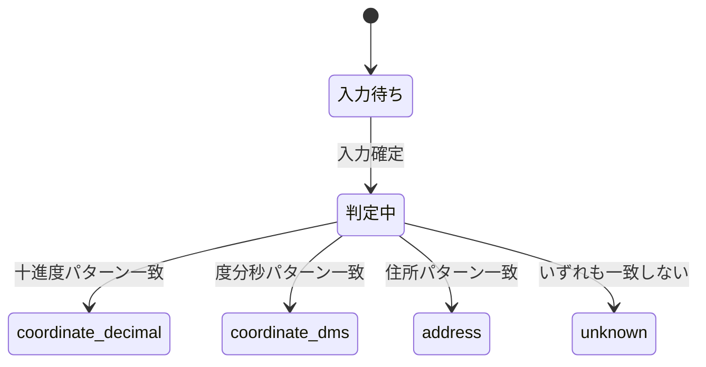

# プロジェクト用語集 (Glossary)

## 概要

このドキュメントは、ichi-linkプロジェクトで使用される用語の定義を管理します。

**更新日**: 2025-01-15

## ドメイン用語

プロジェクト固有のビジネス概念や機能に関する用語。

### 位置情報 (Location Information)

**定義**: 地理的な場所を示す情報。住所または座標で表現される。

**説明**:
ichi-linkが扱う主要なデータ。ユーザーが入力する住所、緯度経度（十進度/度分秒）などの形式を含む。

**関連用語**: [座標](#座標-coordinate)、[住所](#住所-address)

**使用例**:
- 「位置情報を入力してください」
- 「位置情報の形式を自動判定しました」

**英語表記**: Location Information

### 座標 (Coordinate)

**定義**: 緯度と経度のペアで表される地理的位置。

**説明**:
緯度（latitude）と経度（longitude）の2つの数値で構成される。十進度形式（35.6812）または度分秒形式（35°40'52"）で表現される。

**関連用語**: [緯度](#緯度-latitude)、[経度](#経度-longitude)、[測地系](#測地系-geodetic-datum)

**使用例**:
- 「座標を地図で開く」
- 「座標形式を変換する」

**データモデル**: `src/types/coordinate.ts`

**英語表記**: Coordinate

### 緯度 (Latitude)

**定義**: 赤道を基準とした南北の位置を表す角度。

**説明**:
-90度（南極）から+90度（北極）の範囲。北緯はプラス、南緯はマイナスで表す。日本の緯度範囲は約20度〜46度。

**関連用語**: [経度](#経度-longitude)、[座標](#座標-coordinate)

**使用例**:
- 「緯度35.6812」
- 「緯度と経度の順番を確認してください」

**英語表記**: Latitude

### 経度 (Longitude)

**定義**: 本初子午線（グリニッジ）を基準とした東西の位置を表す角度。

**説明**:
-180度から+180度の範囲。東経はプラス、西経はマイナスで表す。日本の経度範囲は約122度〜154度。

**関連用語**: [緯度](#緯度-latitude)、[座標](#座標-coordinate)

**使用例**:
- 「経度139.7671」
- 「経度が日本の範囲外です」

**英語表記**: Longitude

### 住所 (Address)

**定義**: 都道府県、市区町村、町名、番地などで構成される場所の表記。

**説明**:
日本の住所表記に対応。都道府県から番地までを含む文字列として処理する。

**関連用語**: [位置情報](#位置情報-location-information)

**使用例**:
- 「住所を入力してください」
- 「住所として判定しました」

**英語表記**: Address

### 測地系 (Geodetic Datum)

**定義**: 地球上の位置を座標で表すための基準となる座標系。

**説明**:
同じ場所でも測地系が異なると座標値が異なる。主要な測地系として WGS84、JGD2011、旧日本測地系（Tokyo Datum）がある。WGS84とJGD2011の差は最大約10m、旧日本測地系との差は約400-500m。

**関連用語**: [WGS84](#wgs84)、[JGD2011](#jgd2011)、[旧日本測地系](#旧日本測地系-tokyo-datum)

**使用例**:
- 「測地系を選択してください」
- 「推定測地系: WGS84」

**英語表記**: Geodetic Datum

### 十進度 (Decimal Degrees)

**定義**: 緯度経度を小数点付きの数値で表す形式。

**説明**:
最も一般的な座標表記形式。例: 35.6812, 139.7671

**関連用語**: [度分秒](#度分秒-dms)

**使用例**:
- 「十進度形式で入力してください」
- 「十進度の緯度経度として判定」

**英語表記**: Decimal Degrees

### 度分秒 (DMS)

**定義**: 緯度経度を度・分・秒の3つの単位で表す形式。

**説明**:
1度 = 60分、1分 = 60秒。例: 35°40'52"N 139°46'2"E

**関連用語**: [十進度](#十進度-decimal-degrees)

**使用例**:
- 「度分秒形式の座標を入力」
- 「度分秒から十進度に変換」

**英語表記**: Degrees Minutes Seconds (DMS)

### 変換結果 (Conversion Result)

**定義**: 入力された位置情報を処理した結果。

**説明**:
入力データ、変換後の座標（WGS84/JGD2011）、地図URL、警告を含む構造体。

**関連用語**: [警告](#警告-warning)

**データモデル**: `src/types/result.ts`

**英語表記**: Conversion Result

### 警告 (Warning)

**定義**: 入力の曖昧さや潜在的な問題をユーザーに通知するメッセージ。

**説明**:
緯度経度の順番が不自然、測地系が不確定、日本国外の座標などの場合に表示される。

**警告の種類**:
- `coordinate_order_ambiguous`: 緯度経度の順番が曖昧
- `datum_uncertain`: 測地系が不確定
- `outside_japan`: 日本国外の座標
- `low_confidence`: 判定の確信度が低い
- `coordinate_swap_suggested`: 緯度経度入れ替えの提案

**関連用語**: [変換結果](#変換結果-conversion-result)

**データモデル**: `src/types/warning.ts`

**英語表記**: Warning

## 技術用語

プロジェクトで使用している技術・フレームワーク・ツールに関する用語。

### WGS84

**定義**: World Geodetic System 1984。GPSで使用される世界標準の測地系。

**公式情報**: [NGA - WGS84](https://earth-info.nga.mil/php/download.php?file=wgs84)

**本プロジェクトでの用途**:
地図サービス（Google Maps、Apple Maps等）との連携に使用する標準座標系。

**関連用語**: [JGD2011](#jgd2011)、[測地系](#測地系-geodetic-datum)

### JGD2011

**定義**: Japanese Geodetic Datum 2011。2011年の東日本大震災後に制定された日本の測地系。

**公式情報**: [国土地理院](https://www.gsi.go.jp/sokuchikijun/jgd2011.html)

**本プロジェクトでの用途**:
日本国内の正確な座標を扱う際に使用。WGS84との差は最大約10m。

**関連用語**: [WGS84](#wgs84)、[測地系](#測地系-geodetic-datum)

### 旧日本測地系 (Tokyo Datum)

**定義**: 2002年まで使用されていた日本の測地系。

**説明**:
WGS84/JGD2011との差が約400-500mあり、変換なしで使用すると大きな誤差が生じる。

**本プロジェクトでの用途**:
古いシステムからの入力データを正しく変換するために対応。

**関連用語**: [WGS84](#wgs84)、[JGD2011](#jgd2011)

### proj4js

**定義**: JavaScript向けの座標変換ライブラリ。

**公式サイト**: https://github.com/proj4js/proj4js

**本プロジェクトでの用途**:
測地系間の座標変換（WGS84 ↔ JGD2011 ↔ Tokyo Datum）に使用。

**バージョン**: 2.x

**関連ドキュメント**: [アーキテクチャ設計書](./architecture.md)

### React

**定義**: UIを構築するためのJavaScriptライブラリ。

**公式サイト**: https://react.dev/

**本プロジェクトでの用途**:
フロントエンドUIの構築。コンポーネントベースでの状態管理。

**バージョン**: 18.x

**関連ドキュメント**: [アーキテクチャ設計書](./architecture.md)

### Vite

**定義**: 高速なフロントエンドビルドツール。

**公式サイト**: https://vitejs.dev/

**本プロジェクトでの用途**:
開発サーバーとビルドツールとして使用。高速なHMRを提供。

**バージョン**: 5.x

**設定ファイル**: `vite.config.ts`

### Tailwind CSS

**定義**: ユーティリティファーストのCSSフレームワーク。

**公式サイト**: https://tailwindcss.com/

**本プロジェクトでの用途**:
UIコンポーネントのスタイリング。レスポンシブデザインの実装。

**バージョン**: 3.x

**設定ファイル**: `tailwind.config.js`

### Vitest

**定義**: Vite互換の高速テストフレームワーク。

**公式サイト**: https://vitest.dev/

**本プロジェクトでの用途**:
ユニットテスト、統合テストの実行。

**バージョン**: 1.x

**関連ドキュメント**: [開発ガイドライン](./development-guidelines.md#テスト戦略)

### TypeScript

**定義**: JavaScriptに静的型付けを追加したプログラミング言語。

**公式サイト**: https://www.typescriptlang.org/

**本プロジェクトでの用途**:
全てのソースコードをTypeScriptで記述。型安全性を確保。

**バージョン**: 5.x

**設定ファイル**: `tsconfig.json`

**関連ドキュメント**: [開発ガイドライン](./development-guidelines.md#命名規則)

## 略語・頭字語

### DMS

**正式名称**: Degrees Minutes Seconds

**意味**: 度分秒形式。緯度経度を度・分・秒で表す表記法。

**本プロジェクトでの使用**: 入力パーサーで度分秒形式の座標を判定・変換する際に使用。

### GPS

**正式名称**: Global Positioning System

**意味**: 衛星測位システム。WGS84測地系を使用。

**本プロジェクトでの使用**: GPS由来の座標はWGS84として扱う。

### URL

**正式名称**: Uniform Resource Locator

**意味**: インターネット上のリソースの場所を示す文字列。

**本プロジェクトでの使用**: 各地図サービスへのリンクURL生成。

### MVP

**正式名称**: Minimum Viable Product

**意味**: 最小限の機能を持つ実用可能な製品。

**本プロジェクトでの使用**: 初期リリースの機能範囲を定義。

**参考**: [PRD](./product-requirements.md)

### PRD

**正式名称**: Product Requirements Document

**意味**: プロダクト要求定義書。

**本プロジェクトでの使用**: 要件定義ドキュメントとして `docs/product-requirements.md` に配置。

## アーキテクチャ用語

### レイヤードアーキテクチャ (Layered Architecture)

**定義**: システムを役割ごとに複数の層に分割し、上位層から下位層への一方向の依存関係を持たせる設計パターン。

**本プロジェクトでの適用**:
3層アーキテクチャを採用。

```
UIレイヤー (components/)
    ↓
サービスレイヤー (services/)
    ↓
データレイヤー (storage/)
```

**各層の責務**:
- UIレイヤー: ユーザー入力の受付と表示
- サービスレイヤー: 座標変換・判定ロジック
- データレイヤー: 履歴の永続化

**関連コンポーネント**: 全てのソースコード

**参考資料**: [アーキテクチャ設計書](./architecture.md)、[リポジトリ構造定義書](./repository-structure.md)

### サービスレイヤー (Service Layer)

**定義**: ビジネスロジックを実装する層。

**本プロジェクトでの適用**:
座標変換、入力判定、警告生成、URL生成などのロジックを実装。

**関連コンポーネント**:
- `InputParser`: 入力種別の判定
- `CoordinateConverter`: 座標形式の変換
- `DatumTransformer`: 測地系の変換
- `ValidationService`: 検証・警告生成
- `MapUrlGenerator`: 地図URL生成

**参考資料**: [機能設計書](./functional-design.md)

## ステータス・状態

### 入力種別 (Input Type)

**定義**: 入力された位置情報の種別。

**取りうる値**:

| ステータス | 意味 | 判定条件 |
|----------|------|---------|
| `coordinate_decimal` | 十進度形式の座標 | 数値のペア（カンマ/空白区切り） |
| `coordinate_dms` | 度分秒形式の座標 | 度・分・秒の表記を含む |
| `address` | 住所 | 日本語の地名・番地を含む |
| `unknown` | 判定不能 | 上記のいずれにも該当しない |

**状態遷移図**:


**データモデル**: `src/types/input.ts`

### 警告レベル (Warning Severity)

**定義**: 警告の重要度を示すレベル。

**取りうる値**:

| レベル | 意味 | 表示色 | 対応 |
|--------|------|--------|------|
| `info` | 情報提供 | 青 | 確認のみ |
| `warning` | 注意喚起 | 黄 | 内容を確認して判断 |
| `error` | エラー | 赤 | 入力の修正が必要 |

**データモデル**: `src/types/warning.ts`

## データモデル用語

### LocationInput

**定義**: パース前の入力データを表すエンティティ。

**主要フィールド**:
- `rawInput`: 生の入力文字列
- `inputType`: 判定された入力種別
- `confidence`: 判定の確信度 (0-1)
- `parsedData`: パース結果

**関連エンティティ**: [ParsedCoordinate](#parsedcoordinate)、[ConversionResult](#conversionresult-entity)

**制約**: `rawInput`は1000文字以内

### ParsedCoordinate

**定義**: パース済みの座標データを表すエンティティ。

**主要フィールド**:
- `latitude`: 緯度（十進度）
- `longitude`: 経度（十進度）
- `originalFormat`: 元の形式
- `assumedDatum`: 推定測地系
- `datumConfidence`: 測地系推定の確信度

**関連エンティティ**: [LocationInput](#locationinput)

**制約**:
- `latitude`: -90 〜 90
- `longitude`: -180 〜 180

### ConversionResult (Entity)

**定義**: 変換結果を表すエンティティ。

**主要フィールド**:
- `input`: 入力データ
- `coordinates`: WGS84/JGD2011座標
- `mapUrls`: 各地図サービスのURL
- `warnings`: 警告一覧
- `timestamp`: 変換日時

**関連エンティティ**: [LocationInput](#locationinput)、[Warning (Entity)](#warning-entity)

### Warning (Entity)

**定義**: 警告を表すエンティティ。

**主要フィールド**:
- `type`: 警告種別
- `message`: 警告メッセージ
- `severity`: 警告レベル

**関連エンティティ**: [ConversionResult](#conversionresult-entity)

## エラー・例外

### ValidationError

**クラス名**: `ValidationError`

**発生条件**: 入力値がビジネスルールに違反した場合。

**対処方法**:
- ユーザー: エラーメッセージに従って入力を修正
- 開発者: バリデーションロジックが正しいか確認

**例**:
```typescript
throw new ValidationError('位置情報を入力してください', 'input', '');
```

### ParseError

**クラス名**: `ParseError`

**発生条件**: 入力文字列を解析できなかった場合。

**対処方法**:
- ユーザー: 入力形式を確認して再入力
- 開発者: パーサーが対応していない形式かどうか確認

**例**:
```typescript
throw new ParseError('座標の形式を判定できませんでした', input);
```

## 計算・アルゴリズム

### 度分秒→十進度変換

**定義**: 度分秒形式の座標を十進度に変換する計算。

**計算式**:
```
十進度 = 度 + (分 / 60) + (秒 / 3600)
```

**実装箇所**: `src/services/converter/CoordinateConverter.ts`

**例**:
```
入力: 35°40'52"
出力: 35 + (40/60) + (52/3600) = 35.6811...
```

### 座標範囲検証（日本国内判定）

**定義**: 座標が日本国内かどうかを判定するアルゴリズム。

**判定基準**:
- 緯度: 20° 〜 46°
- 経度: 122° 〜 154°

**実装箇所**: `src/services/validator/ValidationService.ts`

**例**:
```
入力: (35.6812, 139.7671)
出力: true (日本国内)

入力: (51.5074, -0.1278)
出力: false (ロンドン、日本国外)
```

## 索引

### あ行
- [位置情報](#位置情報-location-information) - ドメイン用語

### か行
- [経度](#経度-longitude) - ドメイン用語
- [警告](#警告-warning) - ドメイン用語

### さ行
- [座標](#座標-coordinate) - ドメイン用語
- [十進度](#十進度-decimal-degrees) - ドメイン用語
- [住所](#住所-address) - ドメイン用語

### た行
- [度分秒](#度分秒-dms) - ドメイン用語

### は行
- [変換結果](#変換結果-conversion-result) - ドメイン用語

### ま行
- [測地系](#測地系-geodetic-datum) - ドメイン用語

### A-Z
- [DMS](#dms) - 略語
- [GPS](#gps) - 略語
- [JGD2011](#jgd2011) - 技術用語
- [MVP](#mvp) - 略語
- [PRD](#prd) - 略語
- [proj4js](#proj4js) - 技術用語
- [React](#react) - 技術用語
- [Tailwind CSS](#tailwind-css) - 技術用語
- [TypeScript](#typescript) - 技術用語
- [URL](#url) - 略語
- [Vite](#vite) - 技術用語
- [Vitest](#vitest) - 技術用語
- [WGS84](#wgs84) - 技術用語
